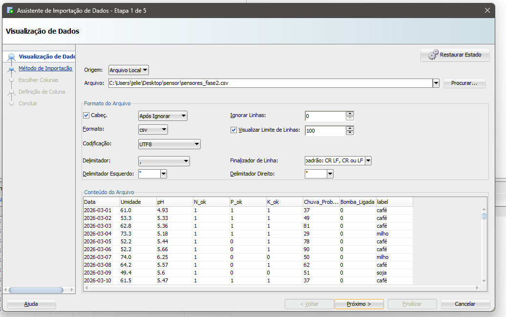
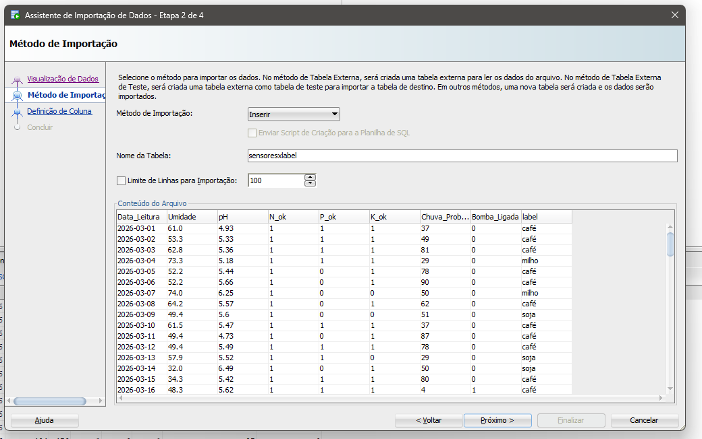
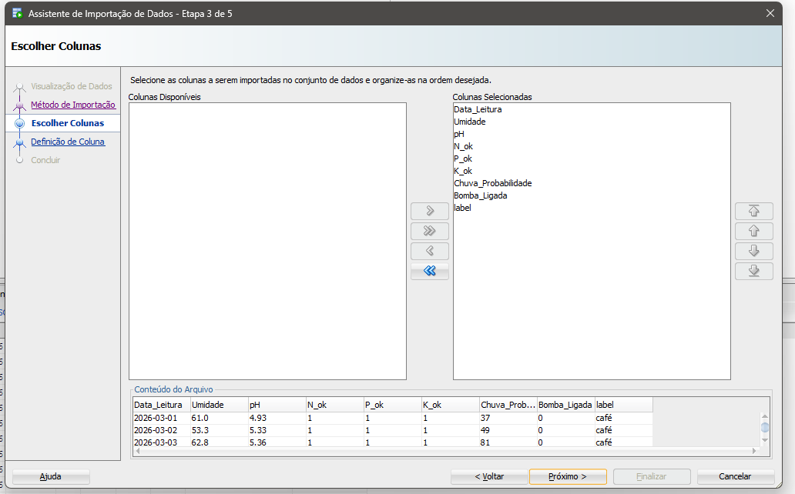
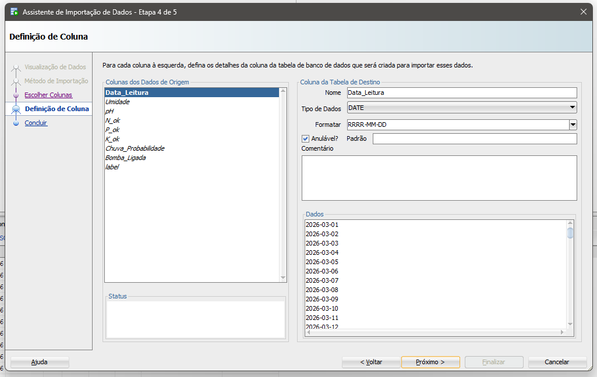
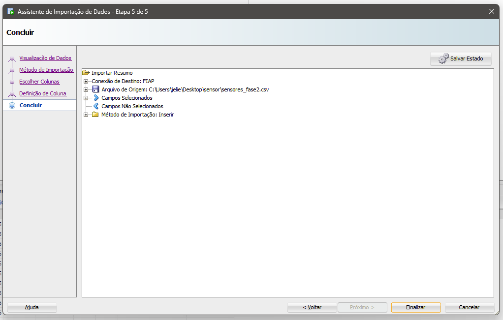
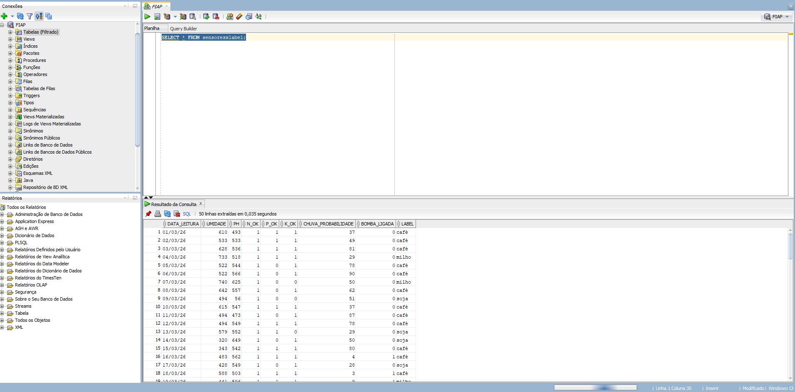
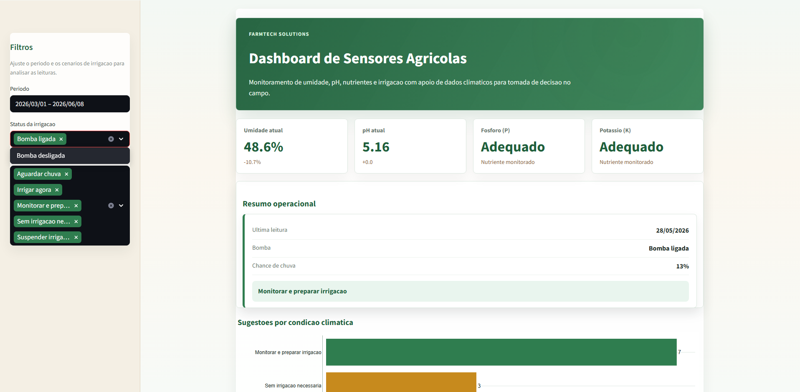
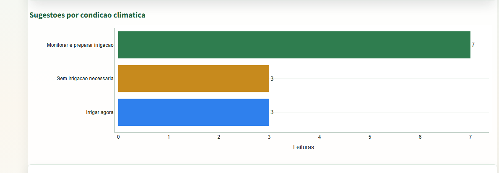
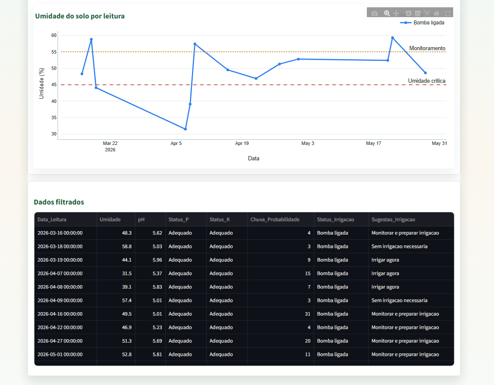

# PBL Fase 3 - Sensores Agricolas

Repositorio organizado para a entrega da Fase 3, usando como base o arquivo `sensores_fase2.csv` da Fase 2.

## Estrutura

```text
.
|-- app.py
|-- run_dashboard.bat
|-- requirements.txt
|-- sensores_fase2.csv
|-- prints/
|   |-- 01_visualizacao_dados_csv.png
|   |-- 02_metodo_importacao.png
|   |-- 03_escolha_colunas.png
|   |-- 04_definicao_colunas.png
|   |-- 05_resumo_importacao.png
|   |-- 06_consulta_select_resultado.png
|   |-- 07_dashboard_visao_geral.png
|   |-- 08_dashboard_grafico_niveis.png
|   `-- 09_dashboard_dados_filtrados.png
|-- notebooks/
|   `-- SeuNome_RM572665_fase3_cap1.ipynb
`-- sql/
    `-- consultas_oracle.sql
```

## PBL - Project-Based Learning - FarmTech Solutions

Esta secao documenta o fluxo seguido no Oracle SQL Developer para importar o arquivo `sensores_fase2.csv`.

### Base utilizada

Foi utilizado o arquivo da Fase 2:

- `sensores_fase2.csv`

### Passos realizados

1. No Assistente de Importacao de Dados, foi selecionado o arquivo local `sensores_fase2.csv`, com formato CSV, delimitador por virgula e codificacao UTF-8.
2. O metodo de importacao escolhido foi `Inserir`, criando/importando os dados para a tabela `sensoresxlabel`.
3. As colunas do CSV foram selecionadas para importacao: `Data_Leitura`, `Umidade`, `pH`, `N_ok`, `P_ok`, `K_ok`, `Chuva_Probabilidade`, `Bomba_Ligada` e `label`.
4. Na etapa de definicao de coluna, `Data_Leitura` foi configurada como `DATE`, com formato `RRRR-MM-DD`.
5. A tela final do assistente apresentou o resumo da importacao.
6. A consulta `SELECT * FROM sensoresxlabel;` foi executada para validar os registros importados.

### Consulta realizada

```sql
SELECT * FROM sensoresxlabel;
```

O arquivo com as consultas esta em:

- `sql/consultas_oracle.sql`

## Prints do banco

### 1. Visualizacao do CSV no assistente



### 2. Metodo de importacao



### 3. Escolha das colunas



### 4. Definicao das colunas



### 5. Resumo da importacao



### 6. Consulta realizada



## Dependencias

As bibliotecas usadas estao em `requirements.txt`.

Instalacao em um ambiente virtual:

```powershell
python -m venv .venv
.venv\Scripts\python.exe -m pip install -r requirements.txt
```

## Programa ir Além - Dashboard em Python

O arquivo `app.py` implementa uma dashboard em Streamlit para visualizar:

- niveis de umidade, P, K e pH;
- status da irrigacao;
- sugestoes de irrigacao com base na umidade e na probabilidade de chuva.

### Como executar

```powershell
.venv\Scripts\streamlit.exe run app.py
```

Ou use o arquivo:

```text
run_dashboard.bat
```

### Prints da dashboard

#### Visao geral da dashboard



#### Grafico de niveis ao longo do tempo



#### Tabela de dados filtrados



## Programa ir Além - Machine Learning no Agronegocio

A entrega da analise de Machine Learning esta em:

- `notebooks/SeuNome_RM572665_fase3_cap1.ipynb`

O notebook contem:

- analise exploratoria com graficos;
- identificacao do perfil ideal de solo/clima para cafe, soja e milho;
- treinamento de modelos preditivos;
- avaliacao comparativa dos modelos.
