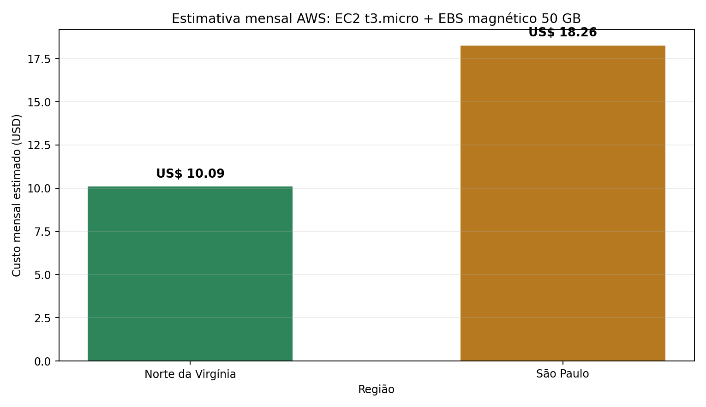
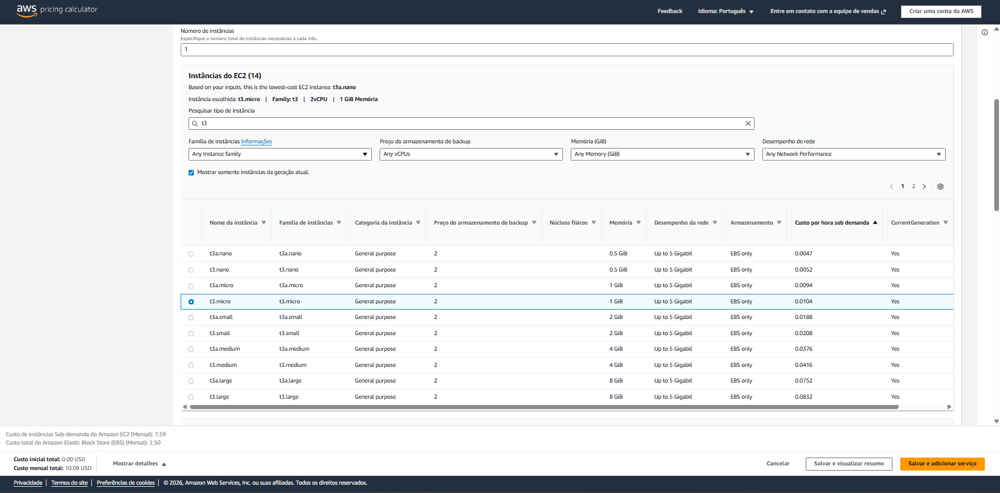
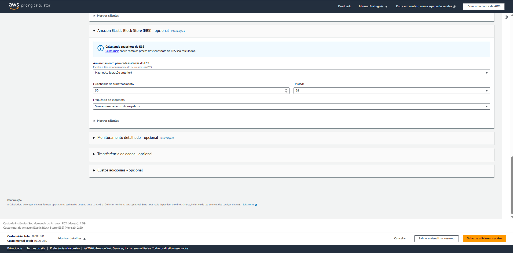
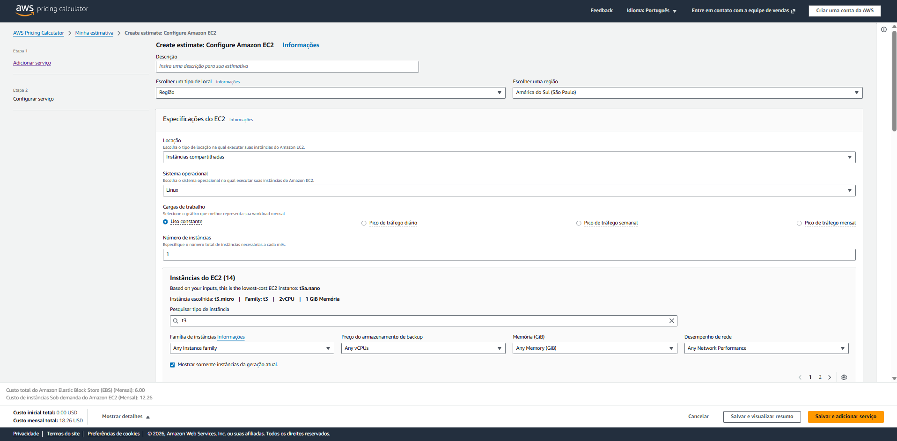
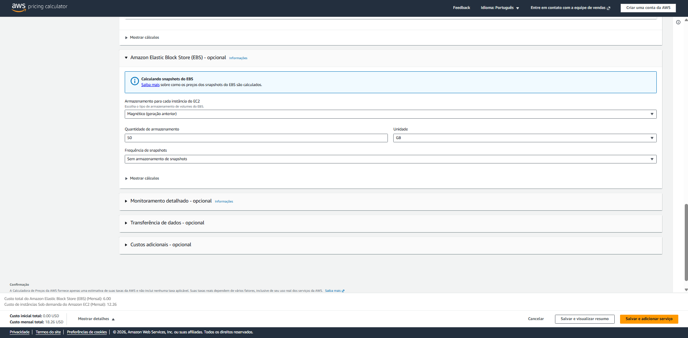

# FarmTech Solutions — Fase 5

Projeto acadêmico com duas entregas obrigatórias: Machine Learning e computação em nuvem. Inclui também o Ir Além com ESP32 físico e dois sensores.

Integrante: Jeliel Cardoso — RM 572665.

## Entrega 1 — Machine Learning

[Abra o notebook executado](entrega1_ml/notebooks/JelielCardoso_RM572665_pbl_fase4.ipynb) para acompanhar o relatório completo, o código, as tabelas, gráficos e conclusões. O nome do arquivo preserva o sufixo pbl_fase4.ipynb solicitado literalmente no enunciado da Fase 5.

A análise usa o CSV oficial com 156 registros, explora tendências por agrupamento, identifica outliers e compara cinco regressões. O modelo Extra Trees foi selecionado pela validação cruzada por grupos; no teste, obteve RMSE 6268,09 e R² 0,9924. As limitações, a unidade original de Yield e as métricas por cultura estão detalhadas no notebook.

[Vídeo 1 — Machine Learning](https://www.youtube.com/watch?v=dIXJ3ubKnV8)

[Instruções para reprodução](entrega1_ml/README.md). Mantenha as pastas e scripts juntos ao executar o notebook.

## Entrega 2 — Computação em Nuvem AWS

Estimativa para hospedar a API e o modelo em uma máquina Linux compartilhada, t3.micro, com 2 vCPUs, 1 GiB de memória e rede em rajada até 5 Gbps. Uso constante, 730 horas/mês, 100% On-Demand, com EBS magnético (geração anterior) de 50 GB, sem snapshots.

| Região | EC2 por hora (USD) | EC2 mensal (USD) | EBS mensal (USD) | Total mensal (USD) |
|---|---:|---:|---:|---:|
| Norte da Virgínia — us-east-1 | 0,0104 | 7,59 | 2,50 | **10,09** |
| São Paulo — sa-east-1 | 0,0168 | 12,26 | 6,00 | **18,26** |



**Conclusão:** entre as duas configurações comparadas, Virgínia é US$ 8,17/mês mais barata. Para o cenário que restringe o armazenamento no exterior, a escolha é São Paulo, mantendo os dados no Brasil. A proximidade pode favorecer o acesso, mas a latência real não foi medida.

Os valores reproduzem as capturas da AWS Pricing Calculator fornecidas pelo aluno. A estimativa cobre EC2 e capacidade EBS; não inclui impostos, suporte, tráfego adicional, snapshots, IPv4 público ou cobranças adicionais de créditos de CPU/I/O. Não representa uma fatura completa de produção. A atividade é de estimativa; não houve implantação na AWS.

### Evidências da calculadora

Virgínia — instância e custo:


Virgínia — EBS magnético de 50 GB e total:


São Paulo — região e configuração:


São Paulo — EBS magnético de 50 GB e total:


Os recortes da Virgínia não mostram o seletor de região; sua identificação corresponde à captura informada pelo aluno. Os valores visíveis são coerentes com a estimativa documentada.

[Vídeo 2 — Comparação AWS](https://www.youtube.com/watch?v=N1n0pr-CVUY)

[Reprodução da tabela e gráfico](entrega2_aws/README.md). Fonte da estimativa: [AWS Pricing Calculator](https://calculator.aws/).

## Ir Além — ESP32 com Wi-Fi

Dois sensores distintos: DHT22 para temperatura/umidade do ar e sonda resistiva para umidade do solo. O ESP32 transmite JSON por HTTP via Wi-Fi para um servidor Flask no PC; os dados são armazenados no SQLite e exibidos no Streamlit. Essa combinação permite demonstrar coleta, armazenamento e visualização em rede local.


[Documentação, ligações, justificativa dos sensores e código](ir_alem_esp32/README.md) · [Guia de execução](ir_alem_esp32/PASSO_A_PASSO_USO.md)

A integração física foi validada com HTTP 201 e persistência das leituras. O percentual do solo é relativo à calibração; as recomendações usam regras, sem integração com o modelo de rendimento. O banco é criado automaticamente na execução; a pasta de entrega inclui [amostra dos registros validados](evidencias_validacao/esp32_leituras_validadas.json).

[Vídeo 3 — ESP32 e sensores](https://youtube.com/shorts/5rXYAvTRx2M)

## Execução

Requer Python 3.12. Na pasta que contém este README:

```powershell
py -3.12 -m venv .venv
.\.venv\Scripts\python.exe -m pip install -r requirements.txt
.\.venv\Scripts\python.exe entrega1_ml/scripts/gerar_notebook.py
.\.venv\Scripts\python.exe entrega2_aws/scripts/gerar_comparativo_aws.py
```

O primeiro script reexecuta e salva o notebook; o segundo reproduz a tabela/gráfico com as tarifas documentadas, sem consultar preços ao vivo. O CSV oficial não é sobrescrito pelo gerador de demonstração.

Para abrir o notebook interativamente, use VS Code com suporte Jupyter e selecione o Python da pasta .venv. As instruções específicas de inicialização do receptor e dashboard estão no guia do ESP32.
