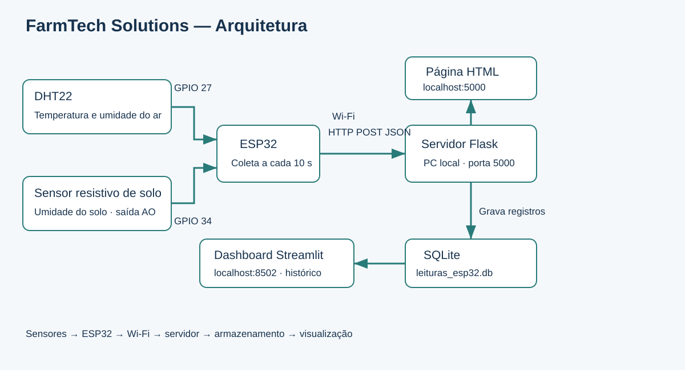
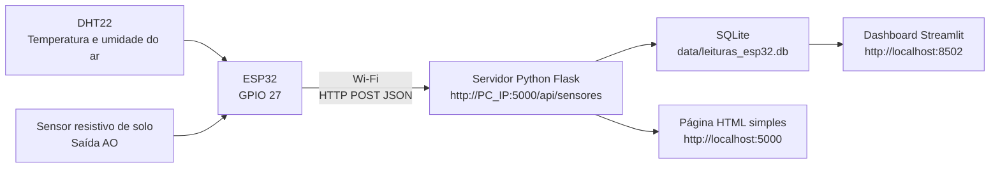
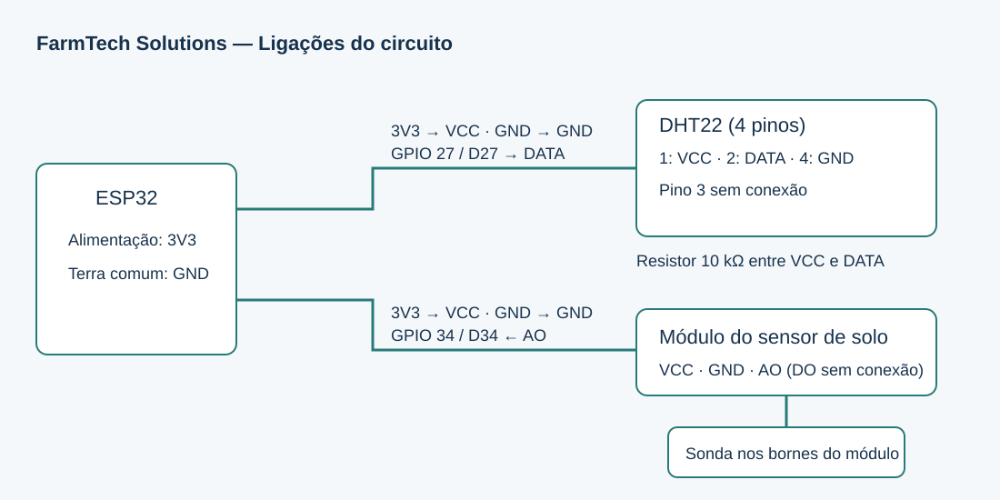
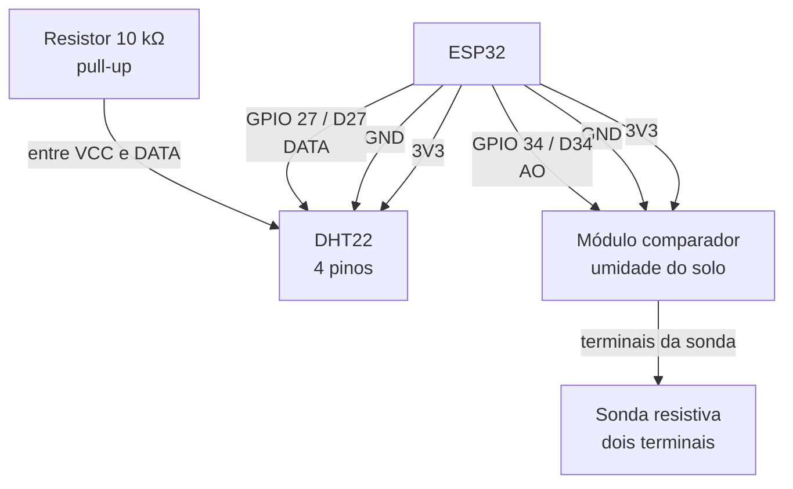

# FarmTech Solutions - Fase 5 - Ir Além ESP32

Sistema de coleta e comunicação de dados usando ESP32 real, Wi-Fi, sensores agrícolas e serviço local em Python.

[Vídeo da demonstração funcional](https://youtube.com/shorts/5rXYAvTRx2M)

## Objetivo

Este projeto atende ao **Ir Além Opção 1** da Fase 5: usar um ESP32 real para coletar dados de sensores compatíveis com o contexto da FarmTech Solutions e enviar esses dados via Wi-Fi para um serviço local.

A solução implementada usa:

- ESP32 real com Wi-Fi;
- DHT22 para temperatura e umidade do ar;
- sensor resistivo de umidade do solo com leitura analógica;
- servidor HTTP local em Python/Flask;
- banco SQLite local;
- dashboard Streamlit para visualização.

## Sensores escolhidos

O DHT22 foi escolhido porque temperatura e umidade do ar influenciam diretamente evapotranspiração, risco hídrico e produtividade agrícola.

O sensor resistivo de umidade do solo foi escolhido porque indica a disponibilidade de água no solo e permite apoiar decisões de irrigação.

Juntos, eles representam dois sensores distintos e alinhados ao contexto agrícola do projeto.

## Ligações usadas

### DHT22

| ESP32 | DHT22 |
| --- | --- |
| 3V3 | pino 1 - VCC |
| D27 | pino 2 - DATA |
| não conectado | pino 3 |
| GND | pino 4 - GND |

Resistor de 10 kΩ entre VCC e DATA, funcionando como pull-up do DHT22.

### Sensor de umidade do solo

| ESP32 | Módulo do sensor |
| --- | --- |
| 3V3 | VCC |
| GND | GND |
| D34 | AO |
| não conectado | DO |

Os dois terminais da sonda resistiva ficam ligados nos bornes próprios do módulo.

## Arquitetura



<details>
<summary>Código-fonte Mermaid da arquitetura</summary>



</details>

## Figura do circuito



<details>
<summary>Código-fonte Mermaid do circuito</summary>



</details>

## Estrutura

```text
pbl/fase5/ir_alem_esp32
|-- README.md
|-- requirements.txt
|-- setup_env.bat
|-- run_all.bat
|-- run_receiver.bat
|-- run_dashboard.bat
|-- run_api_test.bat
|-- show_pc_ip.bat
|-- arduino/
|   `-- farmtech_esp32_iot/
|       `-- farmtech_esp32_iot.ino
|-- dashboard/
|   `-- app.py
|-- data/
|   `-- .gitkeep
|-- receiver/
|   `-- server.py
|-- scripts/
|   |-- descobrir_ip_pc.py
|   |-- validar_api.py
|   `-- enviar_leitura_teste.py
`-- sql/
    `-- schema_sqlite.sql
```

## Como executar no PC

Para um guia operacional completo de bancada, consulte [PASSO_A_PASSO_USO.md](PASSO_A_PASSO_USO.md).

Abra a pasta `pbl/fase5/ir_alem_esp32` e execute:

```powershell
run_all.bat
```

Esse arquivo prepara o ambiente Python, instala as dependências e abre duas janelas:

- servidor HTTP em `http://localhost:5000`;
- dashboard Streamlit em `http://localhost:8502`.

O próprio `run_all.bat` também mostra a URL que deve ser copiada para `SERVER_URL` no sketch do ESP32.

Se preferir rodar separadamente:

```powershell
run_receiver.bat
run_dashboard.bat
```

Para descobrir apenas o IP local do computador:

```powershell
show_pc_ip.bat
```

## Teste sem o ESP32

Com o servidor HTTP rodando, envie uma leitura simulada:

```powershell
py scripts\enviar_leitura_teste.py
```

Ou execute o teste completo da API:

```powershell
run_api_test.bat
```

Depois abra:

- `http://localhost:5000` para ver a página HTML simples;
- `http://localhost:8502` para ver o dashboard Streamlit.

## Como gravar o ESP32

1. Instale a Arduino IDE.
2. Em **Boards Manager**, instale o pacote **esp32 by Espressif Systems**.
3. Em **Library Manager**, instale:
   - **DHT sensor library**;
   - **Adafruit Unified Sensor**.
4. Abra o arquivo `arduino/farmtech_esp32_iot/farmtech_esp32_iot.ino`.
5. Copie `config.example.h` para `config.h` na mesma pasta da sketch.
6. Ajuste no `config.h`:
   - `WIFI_SSID`;
   - `WIFI_PASSWORD`;
   - `SERVER_URL`.
   - `ENABLE_WIFI_SEND`.
7. Para descobrir o IP do computador, use no PowerShell:

```powershell
ipconfig
```

Procure o IPv4 da rede Wi-Fi e monte a URL assim:

```cpp
const char* SERVER_URL = "http://SEU_IP_LOCAL:5000/api/sensores";
```

Exemplo:

```cpp
const char* SERVER_URL = "http://192.168.0.100:5000/api/sensores";
```

8. Selecione a placa ESP32 e a porta correta.
9. Faça upload do sketch.
10. Abra o Serial Monitor em `115200 baud`.

Para validar apenas os sensores antes do envio pela rede, deixe:

```cpp
const bool ENABLE_WIFI_SEND = false;
```

Depois que temperatura, umidade do ar e umidade do solo estiverem aparecendo corretamente no Serial Monitor, altere para:

```cpp
const bool ENABLE_WIFI_SEND = true;
```

## O que validar no Serial Monitor

O Serial Monitor deve mostrar:

- conexão Wi-Fi concluída;
- IP local do ESP32;
- temperatura do ar;
- umidade do ar;
- valor bruto do sensor de solo;
- umidade do solo em porcentagem;
- payload JSON enviado;
- status HTTP `201` quando o servidor aceitar a leitura.

Se o ESP32 mostrar erro de conexão com o servidor, confirme se o PC e o ESP32 estão na mesma rede Wi-Fi e libere o Python no Firewall do Windows para redes privadas.

## Contrato da API

Endpoint:

```text
POST http://localhost:5000/api/sensores
```

JSON enviado pelo ESP32:

```json
{
  "device_id": "esp32-farmtech-01",
  "temperature_air_c": 26.4,
  "humidity_air_pct": 62.3,
  "soil_raw": 2480,
  "soil_moisture_pct": 36.0,
  "wifi_rssi": -52,
  "esp32_millis": 128000
}
```

Resposta esperada:

```json
{
  "status": "ok",
  "id": 1,
  "risk_level": "Médio",
  "recommendation": "Irrigar o canteiro, pois a umidade do solo está baixa."
}
```

## Banco de dados

O servidor cria automaticamente o banco:

```text
data/leituras_esp32.db
```

A tabela principal é `sensor_readings`, contendo:

- identificação do dispositivo;
- data/hora recebida;
- temperatura do ar;
- umidade do ar;
- leitura bruta do sensor de solo;
- umidade do solo em porcentagem;
- força do Wi-Fi;
- nível de risco;
- recomendação automática.

## Calibração do sensor de solo

No sketch existem dois valores iniciais:

```cpp
const int SOIL_DRY_RAW = 3200;
const int SOIL_WET_RAW = 1200;
```

Para melhorar a precisão:

1. leia o valor bruto com a sonda seca;
2. substitua esse valor em `SOIL_DRY_RAW`;
3. leia o valor bruto com a sonda em solo bem úmido;
4. substitua esse valor em `SOIL_WET_RAW`.

## Roteiro curto para vídeo do Ir Além

1. Mostre o ESP32 conectado por USB e os sensores já ligados.
2. Abra o sketch na Arduino IDE e aponte para os pinos `D27` e `D34`, Wi-Fi e `SERVER_URL`.
3. Abra o Serial Monitor e mostre temperatura, umidade do ar, umidade do solo e status HTTP.
4. Abra `http://localhost:5000` e mostre a leitura chegando na página HTML.
5. Abra `http://localhost:8502` e mostre cards, gráfico histórico e tabela.
6. Explique que o servidor grava os dados em SQLite e gera uma recomendação automática de manejo.
